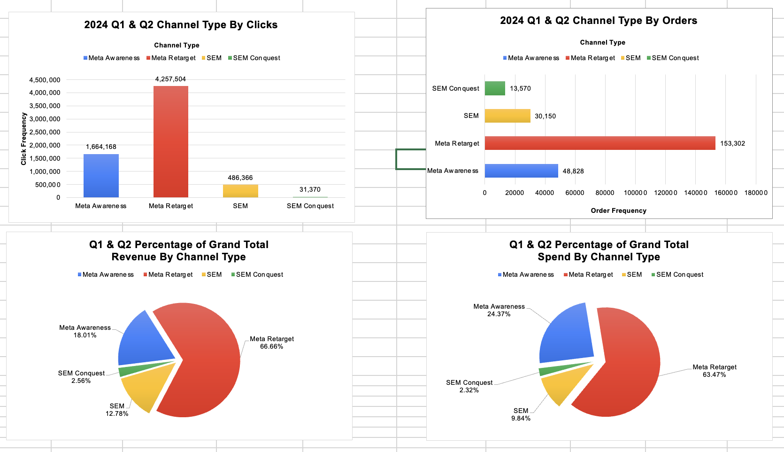
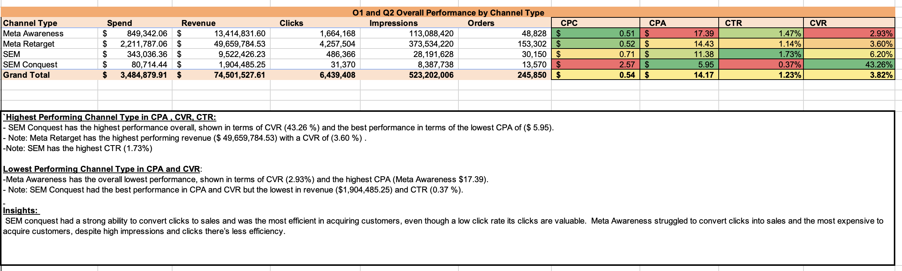
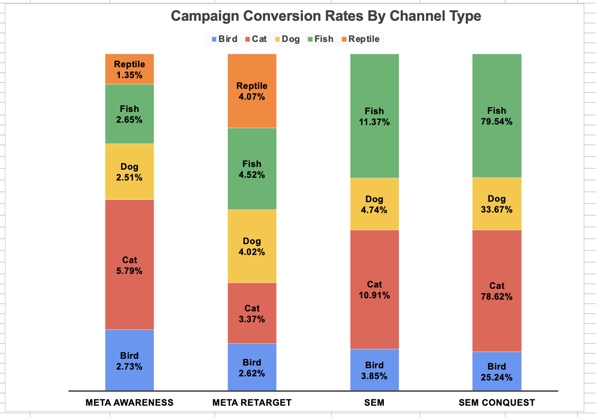
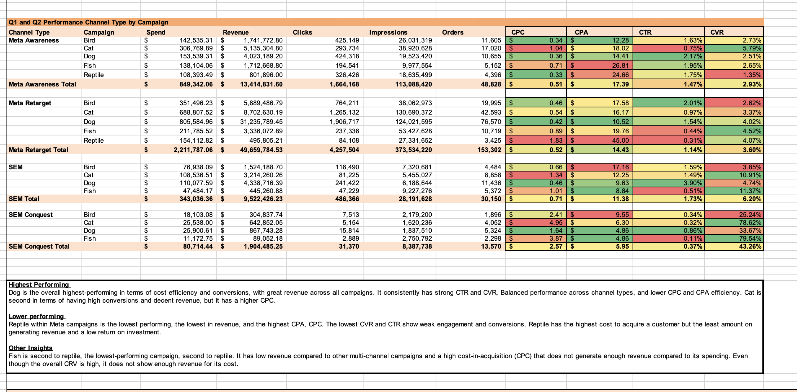
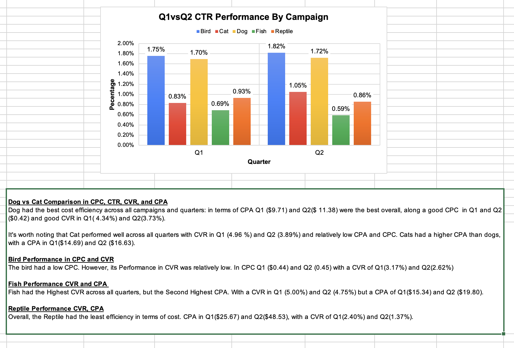
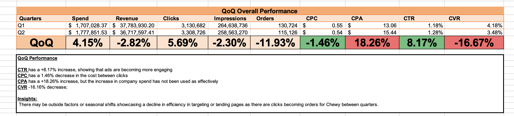
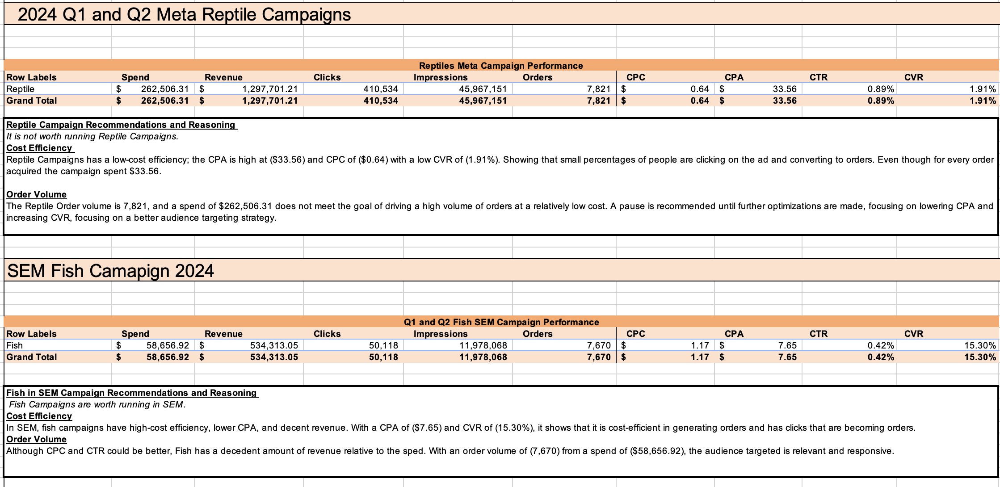

# Marketing Data Analytics Project
Data Analytics Excel Report on Mock Chewy data from Landing Pages to evaluate Campaign Performance

## Project Overview
This project analyzes SEM and Paid Social performance for Q1 and Q2 of 2024. The objective is to uncover insights across campaigns, channels, and demographics, evaluate cost efficiency, and provide actionable recommendations to optimize marketing spend and performance.

The analysis focuses on:
- Historical performance by channel and campaign
- Campaign efficiency (CPA, CPC, CVR, CTR)
- High vs. low-performing campaigns
- Demographic trends and targeting opportunities
- Quarterly performance comparisons (Q1 vs Q2)

---

## Data Description
All raw and processed data used in this analysis are included in the `Data/` folder:

- **Raw Data:** Original CSV/Excel exports from SEM and Paid Social platforms.
- **Processed Data:** Combined datasets using Power Query, with calculated fields for CPC, CPA, CTR, and CVR.
- **Metrics:** Additional pivot tables and Excel functions applied to generate insights.

Key columns include:
- `Quarter`, `Channel`, `Campaign Name`, `Channel Type`, `Spend`, `Revenue`, `Clicks`, `Impressions`, `Orders`

---

## Methodology

1. **Data Cleaning & Transformation**
   - Combined SEM and Paid Social datasets using Power Query.
   - Standardized column names and formats (dates, currency, metrics).
   - Calculated derived metrics:  
     - CPC = Spend / Clicks  
     - CPA = Spend / Orders  
     - CTR = (Clicks / Impressions) * 100  
     - CVR = (Orders / Clicks) * 100

2. **Pivot Tables**
   - **Overall Performance by Channel:** Summarizes total spend, revenue, clicks, orders, CPC, CPA, CTR, CVR by channel.
   - **Performance by Campaign:** Breakdown of metrics for each campaign, segmented by channel.
   - **Quarterly Comparison (Q1 vs Q2):** Evaluates trends in CPC, CPA, CTR, CVR, revenue, and orders.
   - **High vs. Low Performing Campaigns:** Highlights campaigns with the strongest and weakest cost efficiency and conversions.
   - **Campaign Type Analysis:** Evaluates retargeting, awareness, and conquest campaigns across channels.

3. **Demographic Insights**
   - Analyzed conversion performance by age, gender, and household income.
   - Identified top-performing segments for targeted campaign recommendations.

4. **Visualization**
   - Pivot table charts and screenshots highlight trends and insights.
   - All visual outputs are stored in the `Images/` folder.

Sample subset:

(

---

## Key Insights

- **Top Performing Channels & Campaigns:**
  - SEM Conquest showed the highest CVR (43.26%) and lowest CPA ($5.95), despite a lower CTR.
  - Meta Retarget achieved the highest revenue but with a moderate CVR (0.60%).
  
- **Low Performing Channels & Campaigns:**
  - Meta Awareness had the lowest CVR (2.93%) and highest CPA ($17.39).
  - Fish campaigns underperformed overall, with the lowest revenue and CTR.

- **Quarterly Trends:**
  - CTR increased +8.17% overall from Q1 to Q2, showing stronger engagement.
  - CPC decreased -4.46%, reflecting more efficient spend.
  - CPA increased +18.26% and CVR decreased -16.16%, highlighting declining conversion efficiency despite increased engagement.

- **Demographic Highlights:**
  - Best-performing segment: Females, ages 25-44, top 10% household income.
  - Recommendations: Focus ad targeting and retargeting efforts on these demographics to maximize conversions.

---

## Recommendations

1. **Channel Optimization**
   - Allocate more budget toward SEM Conquest campaigns.
   - Reduce spend on low-performing Meta Awareness campaigns and focus on retargeting.

2. **Campaign-Level Adjustments**
   - Pause underperforming campaigns and keywords.
   - Increase bids for high-converting campaigns (e.g., Dog campaign).

3. **Demographics & Targeting**
   - Focus on high-value segments: Females, 25-44 age group, top 10% income.
   - Adjust creative and messaging to improve engagement in low-performing segments.

4. **Quarterly Strategy**
   - Monitor CVR trends to optimize CPA efficiency.
   - Continue testing ad copy and targeting to improve conversions across Q3 campaigns.

---

## File Structure
Marketing-Data-Analytics-Project/
-  README.md # Project overview and insights
- Data
     - Raw/ # Original SEM & Paid Social data
     -  Processed/ # Combined and cleaned datasets with insights and pivot tables shown 
       
- Insights and Formula Sheet Documentation 
    - Word doc, Excel formula sheet
    - Pivot tables and metric calculations
    - analysis from pivot tables
    - quality assurance
      
- Images/ # Screenshots of pivot table charts

---

## Excel Functions & Formulas

Key Excel functions applied in this analysis:

- `SUMIFS()` → Sum spend or revenue by campaign or channel.
- `COUNTIFS()` → Count clicks or conversions meeting specific thresholds.
- `IFERROR()` → Handle division by zero in CPC, CPA, CVR calculations.
- `VLOOKUP()` / `XLOOKUP()` → Pull related campaign or demographic information.
- `TEXT()` → Format dates for reporting.
- `ROUND()` → Clean up decimal values for metrics.
- Calculated Fields in Pivot Tables: CPC, CPA, CTR, CVR
- Power Query applied to combine multiple datasets and standardize data formatting.

---

## Images & Charts

- Pivot table visualizations and charts are stored in the `Images/` folder.
- Screenshots highlight key trends in channel and campaign performance.

---

## Conclusion

This project demonstrates end-to-end marketing analytics skills, encompassing data cleaning, pivot table creation, Excel formula usage, demographic analysis, campaign insights, and actionable recommendations. All findings are backed by calculated metrics and visualized pivot tables to facilitate informed business decisions.

